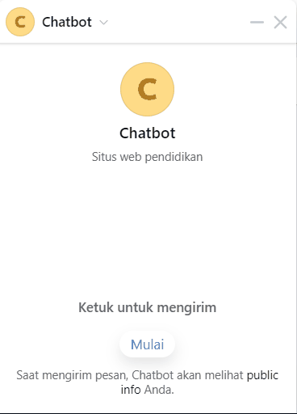
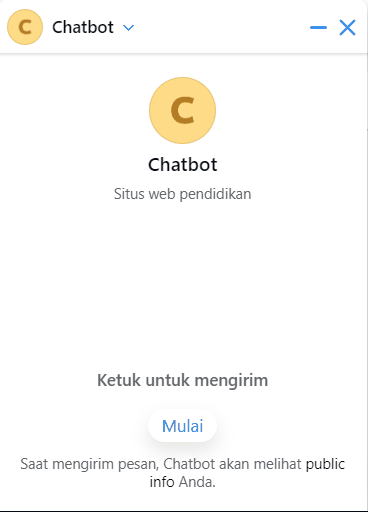
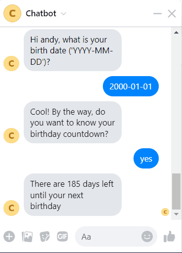
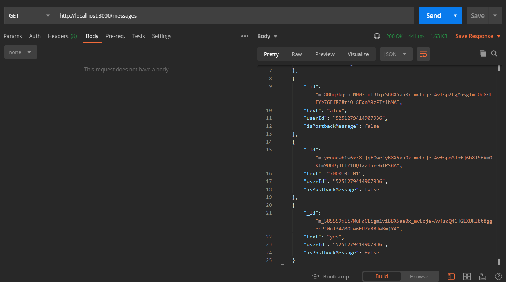
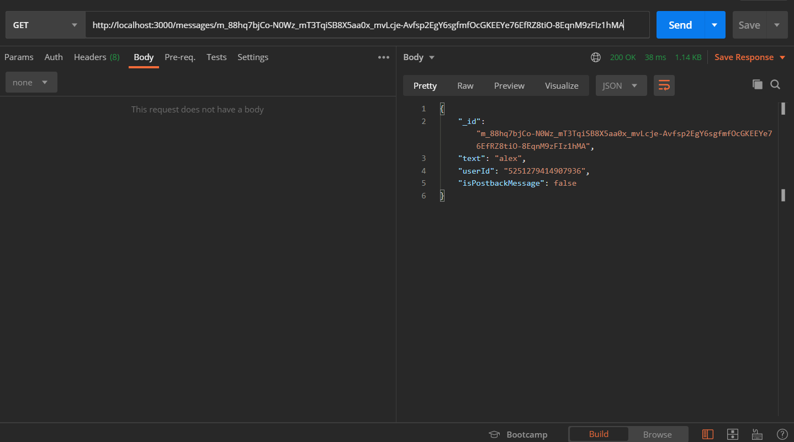
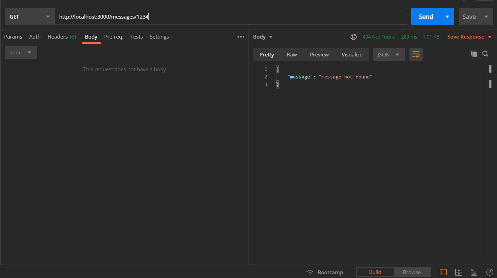
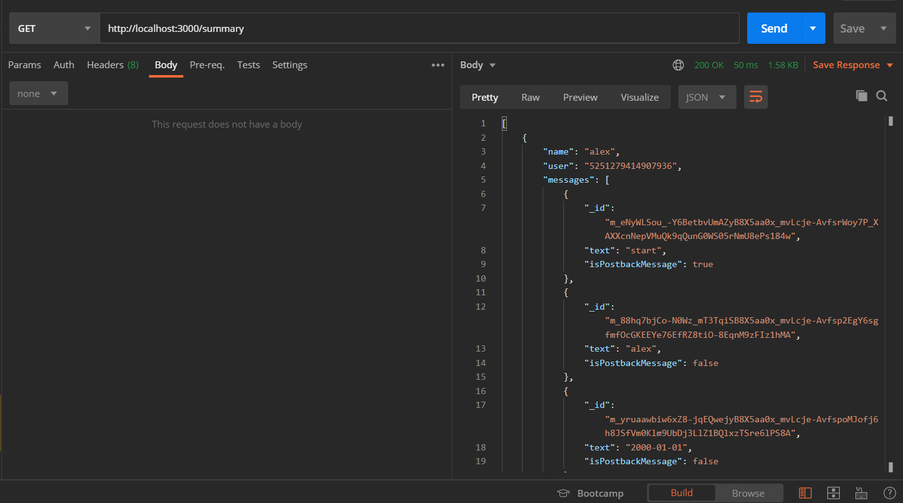

# Facebook Messenger Bot

## Description
This repository contains a simple chatbot used in Facebook Messenger. It features user identity queries and birthday counter.

## Author
Naufal Dean Anugrah - [naufal-dean](https://github.com/naufal-dean)

## Dependencies
1. node (tested in `node version 16.3.0`)
2. npm (tested in `npm version 8.13.1`)
3. MongoDB
4. Browser or Facebook Messenger (optional, to test chatbot)
5. Postman (optional, to test REST endpoints)

## How to run

### Development
1. Install all required dependencies. Use command `npm install`.
2. Prepare MongoDB deployment (for example using [MongoDB Atlas](https://www.mongodb.com/atlas/database)).
3. Copy `.env.example` to `.env` and adjust its values.
    - Set VERIFY_TOKEN to a random secret string, it will be used to verify webhook subscribe process.
    - Skip PAGE_ACCESS_TOKEN for now.
    - Set MONGODB_URI to your MongoDB connection string.
4. Run express server. Use command `npm run dev`.
5. Expose webhook endpoint to the internet (for example using [ngrok](https://ngrok.com/)).
6. If not done, create facebook application ([docs](https://developers.facebook.com/docs/messenger-platform/getting-started/app-setup)) and create page access token.
7. Set PAGE_ACCESS_TOKEN in `.env` with newly created page access token.
8. Chatbot is ready to be used.

### Production
1. Prepare MongoDB deployment (for example using [MongoDB Atlas](https://www.mongodb.com/atlas/database)).
2. Set environment variables defined in `.env.example` to the deployment environment.
    - Set VERIFY_TOKEN to a random secret string, it will be used to verify webhook subscribe process.
    - Skip PAGE_ACCESS_TOKEN for now.
    - Set MONGODB_URI to your MongoDB connection string.
3. Deploy express server somewhere (for example to [heroku](https://www.heroku.com/) or [AWS](https://aws.amazon.com/)) and expose the webhook endpoint to the internet.
4. If not done, create facebook application ([docs](https://developers.facebook.com/docs/messenger-platform/getting-started/app-setup)) and create page access token.
5. Set PAGE_ACCESS_TOKEN in deployment environment.
6. Chatbot is ready to be used.

## How to test
1. Use command `npm run test`.

## Demo

### Chatbot
1. Normal Scenario 1 (Showing Birthday Countdown) 
    ")
2. Normal Scenario 2 (Not Showing Birthday Countdown) 
    ")
3. Special Birthday Message 
    
4. Date Validation Message 
    
5. Reinitiate Conversation 
    

### REST API
1. Get All Messages 
    
2. Get Message by Id 
    
3. Get Message by Id Not Found 
    
4. Get Summary 
    
